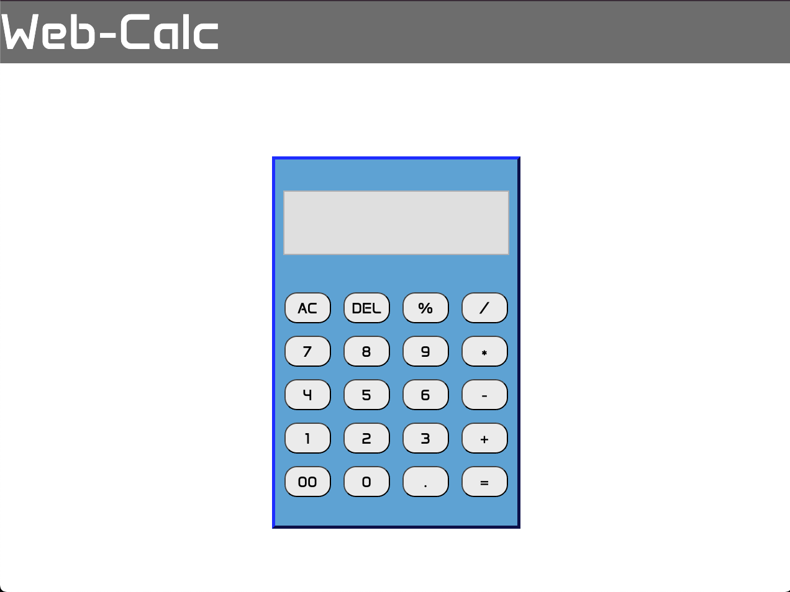

# Web-Calc

A clean, functional web calculator built with HTML, CSS, and JavaScript. Designed to handle basic arithmetic operations with a responsive UI.

Features
	•	Supports addition, subtraction, multiplication, and division
	•	Handles decimal input and “00”
	•	Includes clear (AC), delete (DEL), and error handling for divide-by-zero
	•	Keyboard-free UI with styled digit and operator buttons
	•	Displays error messages and clears automatically on new input

Inspiration
    • Built as a practice project to strengthen JavaScript fundamentals and DOM manipulation skills. 